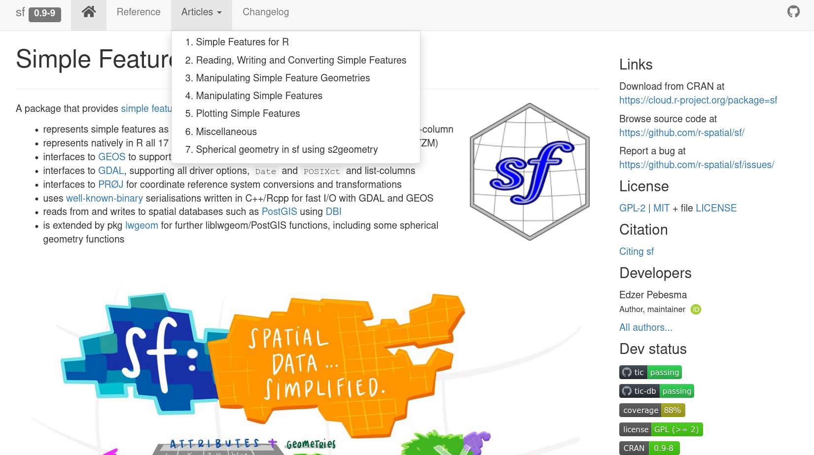
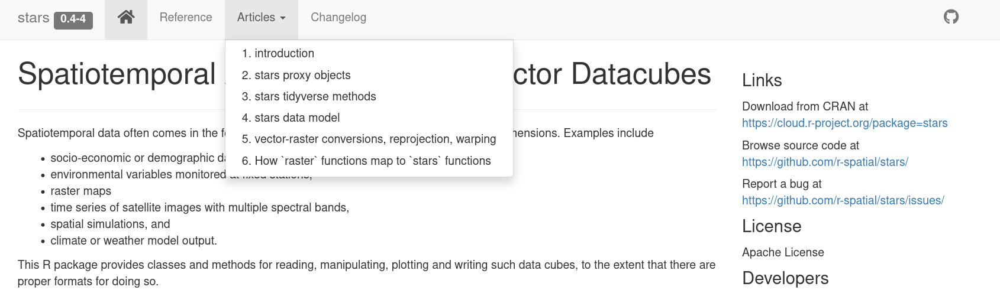

```{r include = FALSE}
source("_setup.R")
```


---

class: inverse, center, middle

# `r nf()` Rationalize


## Why use `r rp()` for spatial data? (`r ck()`~15min)


???

If after the workshop what follows makes sense and you feel it is kind of true, it would a success. 


---

# Spatial Data: Vectors

* Vectors are collections of points

--

* Points may be grouped and ordered (lines, polygons)

--

* Points are georeferenced: coordinates + CRS 


--

* Additional data may be associated with the different points or group of points (attribute table)

--

* Commonly used to represent areas, trajectories....


---
# Spatial Data: Vectors

- Examples of raster file formats: 

  - **ESRI Shapefile** (see https://www.loc.gov/preservation/digital/formats/fdd/fdd000280.shtml)
  - **GeoJSON** (see https://en.wikipedia.org/wiki/GeoJSON)
  - **GeoPackage** (vectors and raster, see https://www.ogc.org/standards/geopackage)
  
--

- `r nf()` More details :

  - https://gisgeography.com/gis-formats/
  - https://gdal.org/drivers/vector/index.html


---

# Spatial Data: Rasters

* Raster are grids of equally sized (most often) cells (or pixels).

--

* Every cell has one or several values (or missing values).

--

* Cells are georeferenced: coordinates + CRS 

--

* Commonly used to represent continuous phenomena (e.g. temperature, elevation) and images (airborne or satellite imagery).


---
# Spatial Data: Rasters

- Examples of vector file formats: 

  - **GeoTIFF** (see https://trac.osgeo.org/geotiff)
  - **NetCDF** (see https://www.unidata.ucar.edu/software/netcdf/)
  - **KML** (also supports vector objects, see https://www.ogc.org/standards/kml/)
  - **GeoPackage** (see https://www.ogc.org/standards/geopackage)
  
--

- `r nf()` More details :

  - https://gisgeography.com/gis-formats/
  - https://gdal.org/drivers/raster/index.html


  
---
# Coding vs clicking

### 1. Programming/coding allows to automate what is frequently done!

--

### 2. Allow to make analyses/reports reproducible 

--

  - create data pipeline 
  - for colleagues and future you

--

### 3. Increase efficiency (spend more time thinking)

--

### 4. Feeling empowered

???

One is not better than the other
do more, ok but do it in a better way


---
# About `r rp()`

> R is a programming language and free software environment for statistical computing and graphics supported by the R Foundation for Statistical Computing. &nbsp;&nbsp; [Wikipedia](https://bit.ly/2WFv1Nu)

--

.center[]

???

Also tons of spatial packages


---
# Why `r rp()`?

<br>

### 1. Freeware + Open source

--

### 2. **Package ecosystem** is rich and under active development  

--

### 3. Many packages connect `r rp()` to other software/language

--

### 4. Community is wide, quite involved, responsive

--

### 5. You are most likely already using it! You are not starting from scratch

--

### **`r ar()` Very little cannot be done with `r rp()`**


???

Very few people look at the R source code but many people are now involved in package dev via GH or GL.

R Python Julia, whatever, language itself matters less that these
If you have time to learn a bit it might sometime makes sense, notably to work with other colleagues.

You don't start from scratch


---
# `r rp()` packages ecosystem for spatial objects

--

## Classes and Methods 

--

## Statistical Analyses

--

## Visualisation

--

## Data Retrieval 

---
# `r rp()` packages ecosystem for spatial objects

## Classes and Methods 

--

### Vectors 

- [`sp`](https://CRAN.R-project.org/package=sp)

--


- [`sf`](https://CRAN.R-project.org/package=sf) `r ch()`

--

### **Rasters** (our main focus)

- [`raster`](https://CRAN.R-project.org/package=raster)
- [`stars`](https://CRAN.R-project.org/package=stars) `r ch()`
- [`terra`](https://CRAN.R-project.org/package=terra) 

`r nf()` https://keen-swartz-3146c4.netlify.app/raster.html#package-stars
`r nf()` https://github.com/rspatial (15 packages)

???

Not visualisation later 


---
# Vectors packages

### [`sp`](https://CRAN.R-project.org/package=sp) .font90[04/2005 (0.7.3) &nbsp; // &nbsp; 01/2021 (1.4.5)]

--

### [`sf`](https://CRAN.R-project.org/package=sf) .font90[10/2016 (0.9.8) &nbsp; // &nbsp; 03/2021 (3.3.7)]

> A package that provides [Simple Features Access](https://en.wikipedia.org/wiki/Simple_Features) for R.

--

As explained in the article ["Simple Features for R"](https://r-spatial.github.io/sf/articles/sf1.html):

> R has well-supported classes for storing spatial data (sp) and interfacing to the above mentioned environments (rgdal, rgeos), but has so far lacked a complete implementation of simple features, making conversions at times convoluted, inefficient or incomplete. The package sf tries to fill this gap, and aims at succeeding sp in the long term. 

---
# Package [`sf`](https://CRAN.R-project.org/package=sf): Simple Features

Very well documented and very popular.

.center[]

.right[.font80[see https://r-spatial.github.io/sf/index.html]]


---
# Raster packages

### [`raster`](https://CRAN.R-project.org/package=raster) .font90[03/2010 (1.0.0) &nbsp; // &nbsp; 11/2020 (3.3.7)]
  
<br>

--
  
### [`terra`](https://CRAN.R-project.org/package=terra) .font90[03/2019 (0.5-2) &nbsp; // &nbsp; 11/2020 (0.9.11)]
  
> terra is an R package that replaces raster. It has a very similar interface, but it is simpler and much faster. 

<br>
--
  
### [`stars`](https://CRAN.R-project.org/package=stars) .font90[07/2018  (0.1-1) &nbsp; // &nbsp; 07/2020 (0.4.3)]
  
> Reading, manipulating, writing and plotting spatiotemporal arrays (raster and vector data cubes) in 'R'. 

Depends on [`sf`](https://CRAN.R-project.org/package=sf).
Note that `stars` and `sf` are [Tidyverse](https://www.tidyverse.org/) friendly.


---
# Package [`stars`](https://CRAN.R-project.org/package=stars): SpatioTemporal ARrayS

### Extent `sf` to Raster and Vector Datacubes

.center[[](https://r-spatial.github.io/stars/index.html)] 
.right[.font80[see https://r-spatial.github.io/stars/index.html]]


---
# Package [`stars`](https://CRAN.R-project.org/package=stars): SpatioTemporal ARrayS

### - Well documented

.center[]
.right[.font80[see https://r-spatial.github.io/stars/index.html]]

--

### - 12 packages depend on/import [`stars`](https://CRAN.R-project.org/package=stars)

### - So far, less material available online, but it's getting better and better!
