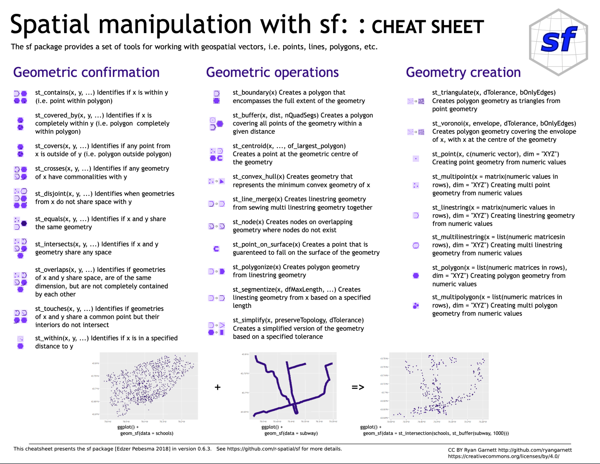
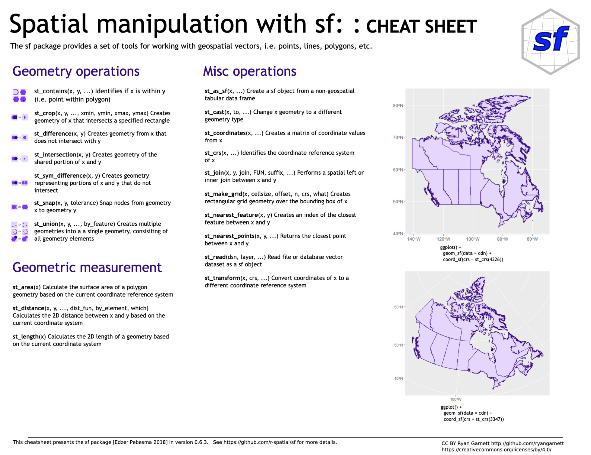

```{r include = FALSE}
source("_setup.R")
library(sf)
library(tidyverse)
```

---

class: inverse, center, middle

# `r nf()` Introduction to `sf`


## `r ck()` ~20min


???

If after the workshop what follows makes sense and you feel it is kind of true, it would a success.

---

# Introduction to `sf`

## `sf` objects


---

# Introduction to `sf`

## `sf` objects

.pull-left[
- Most common geometries:
  - `POINT`: .font80[vector]
  - `MULTIPOINT`: .font80[matrix]
  - `LINESTRING`: .font80[matrix]
  - `MULTILINESTRING`: .font80[list of matrices]
  - `POLYGON`: .font80[list of matrices]
  - `MULTIPOLYGON`: .font80[list of lists of matrices]
  - `GEOMETRYCOLLECTION`: .font80[combinations]
]

.pull-right[

]

--

.font90[`r tr()` More [here](https://www.jessesadler.com/post/simple-feature-objects/) on sf objects and geometries]

---

# Introduction to `sf`

## Importing: from `.csv`

Acess the [Computerized Database of Québec Seabirds (CDQS)](https://open.canada.ca/data/en/dataset/9cd6f8a1-e660-4e78-89a8-6e3f781da556) data using the [`rgovcan`](https://github.com/VLucet/rgovcan) package.

.font90[
```{r csv}
# Output folder
if (!file.exists('output')) dir.create('output')

# remotes::install_github("vlucet/rgovcan")
library(rgovcan)
id <- "9cd6f8a1-e660-4e78-89a8-6e3f781da556"
govcan_dl_resources(id, path = 'output')

# Import csv
cdqs <- read.csv('output/CDQS_BIOMQ_2017.csv')
```
]


---

# Introduction to `sf`

## Importing: from `.csv`

.font90[
```{r csvsf}
cdqs <- st_as_sf(x = cdqs,
                 coords = c("CentroideX", "CentroideY"),
                 crs = 4326)
```
]

.font80[
```{r showcsvsf, echo = FALSE}
cdqs[,1]
```
]

---

# Introduction to `sf`

## Importing: from `.csv`

.font90[
```{r csvplot, fig.width=4, fig.height=4}
plot(cdqs[,1])
```
]

---

# Introduction to `sf`

## Importing: from `.shp`

[Roseate Tern critical habitats in Atlantic Canada](https://open.canada.ca/data/en/dataset/0c469c0e-8afd-4c62-9420-c50af2d34f97)

.font90[
```{r shp, messages = FALSE, warnings = FALSE}
# Download from open canada
id <- "0c469c0e-8afd-4c62-9420-c50af2d34f97"
govcan_dl_resources(id, path = 'output')
unzip("output/Sterna_dougallii_Roseate_Tern_CH_2015.zip", exdir = 'output')
```
]

---

# Introduction to `sf`

## Importing: from `.shp`

[Roseate Tern critical habitats in Atlantic Canada](https://open.canada.ca/data/en/dataset/0c469c0e-8afd-4c62-9420-c50af2d34f97)

.font90[
```{r showshp, messages = FALSE, warnings = FALSE}
# Import shapefile
roseate <- st_read("output/Sterna_dougallii_Roseate_Tern_CH_2015.shp", quiet = TRUE)
roseate
```
]

---


# Introduction to `sf`

## Importing: from `.shp`

[Roseate Tern critical habitats in Atlantic Canada](https://open.canada.ca/data/en/dataset/0c469c0e-8afd-4c62-9420-c50af2d34f97)

.font90[
```{r shpplot}
plot(st_geometry(roseate[4,]))
```
]

---

# Introduction to `sf`

## Importing: from `.geojson`

We already have a geojson included in the workshop data: `st_laurence.geojson`

.font90[
```{r geojson, hold = TRUE}
stl <- st_read('data/st_laurence.geojson', quiet = TRUE)
stl
```
]

--

.font90[`r tr()` We strongly suggest using geojson (single file) rather than shapefiles (multiple files)]

---

# Introduction to `sf`

## Importing: from `.geojson`

We already have a geojson included in the workshop data: `st_laurence.geojson`

.font90[
```{r geojsonplot, fig.width=5, fig.height=4, eval=FALSE}
plot(stl)
```
]

---

# Introduction to `sf`

## Importing: from `.gbd`

[Atlas of Seabirds at Sea in Eastern Canada 2006-2016](https://open.canada.ca/data/en/dataset/f612e2b4-5c67-46dc-9a84-1154c649ab4e)

.font90[
```{r gbd, messages = FALSE, warnings = FALSE}
id <- "f612e2b4-5c67-46dc-9a84-1154c649ab4e"
govcan_dl_resources(id, path = 'output')
unzip("output/AtlasGrid-GrilleAtlas.gdb.zip", exdir = 'output')
```
]

---

# Introduction to `sf`

## Importing: from `.gbd`

[Atlas of Seabirds at Sea in Eastern Canada 2006-2016](https://open.canada.ca/data/en/dataset/f612e2b4-5c67-46dc-9a84-1154c649ab4e)

.font90[
```{r gbdlayer, messages = FALSE, warnings = FALSE}
# Visualize layers available in the geodatabase
st_layers("output/AtlasGrid-GrilleAtlas.gdb")
```
]

---

# Introduction to `sf`

## Importing: from `.gbd`

[Atlas of Seabirds at Sea in Eastern Canada 2006-2016](https://open.canada.ca/data/en/dataset/f612e2b4-5c67-46dc-9a84-1154c649ab4e)

.font90[
```{r gbdload, messages = FALSE, warnings = FALSE}
# Load layer
atlas <- st_read('output/AtlasGrid-GrilleAtlas.gdb',
                  layer = 'AtlasGrid_GrilleAtlas')
```
]


---

# Introduction to `sf`

## Importing: from `.gbd`

[Atlas of Seabirds at Sea in Eastern Canada 2006-2016](https://open.canada.ca/data/en/dataset/f612e2b4-5c67-46dc-9a84-1154c649ab4e)

.font90[
```{r gbdplot, messages = FALSE, warnings = FALSE, fig.width=4,fig.height=4}
plot(st_geometry(atlas))
```
]

---

# Introduction to `sf`

## Exporting

```{r export}
st_write(roseate, "output/roseate.shp", delete_dsn = TRUE)
st_write(stl, "output/stl.geojson", delete_dsn = TRUE)
```

---

# Introduction to `sf`

## Exporting

```{r echo = FALSE}
oldopt <- options()$width
options(width=150)
```

.font60[
```{r drivers}

st_drivers()
```
]

```{r echo = FALSE}
options(width=oldopt)
```


---

# Introduction to `sf`

## Transform between `sf` and `sp`


`r tr()` You can use `st_as_sf()` to transform `sp` object to `sf` objects...

.font80[
```{r sp, eval = FALSE}
# Do not run
newsf <- st_as_sf(oldsp)
```
]

... and vice-versa with `as()`

.font80[
```{r spsf, eval = FALSE}
# Do not run
newsp <- as(oldsf, "Spatial")
```
]


---

# Introduction to `sf`

## Spatial projections

```{r crs}
cdqs <- st_transform(cdqs, st_crs(atlas))
```

`r tr()` Covered in more details in the `stars` portion of the workshop


---

# Introduction to `sf`

## Manipulating attributes

- The `sf` package is built to work well with the `tidyverse`
- As such, you can essentially treat an `sf` object as you would a `data.frame`


---

# Introduction to `sf`

## Manipulating attributes: new variable


```{r attr_hist, fig.width=6,fig.height=4}
hist(cdqs$Nombre.de.nicheurs.Number.of.Breeders)
```

---

# Introduction to `sf`

## Manipulating attributes: new variable

```{r attr_add, fig.width=6,fig.height=4}
cdqs$var2 <- log(cdqs$Nombre.de.nicheurs.Number.of.Breeders+1)
hist(cdqs$var2)
```

---

# Introduction to `sf`

## Manipulating attributes: new variable

```{r attr_add2, fig.width=6,fig.height=4}
cdqs <- cdqs %>% mutate(var3 = log(Nombre.de.nicheurs.Number.of.Breeders+1))
hist(cdqs$var3)
```

---

# Introduction to `sf`

## Manipulating attributes: remove variable

```{r attr_rem, fig.width=6,fig.height=4}
cdqs$var2 <- NULL
cdqs <- cdqs %>% select(-var3)
colnames(cdqs)
```


---

# Introduction to `sf`

## Manipulating attributes: subsets

- Working with conditional statements (use `filter()` from the tidyverse)

.font90[
```{r attr_sub, fig.width=4,fig.height=4}
newcdqs <- cdqs[cdqs$Annee.Year > 2000, ]
plot(st_geometry(cdqs), pch = 1, col = '#2ae9ee', cex = 1)
plot(st_geometry(newcdqs), pch = 20, col = '#d76060', cex = .8, add = TRUE)
```
]

---

# Introduction to `sf`

## Manipulating attributes: joins

```{r attr_join, fig.width=6,fig.height=3.5}
atlas
```


---

# Introduction to `sf`

## Manipulating attributes: joins

.font90[
```{r attr_join2, fig.width=6,fig.height=3.5}
join_data <- data.frame(id = paste0('g', sample(nrow(atlas), nrow(atlas))),
                        value = runif(nrow(atlas)))
join_data[1:10, ]
```
]

---

# Introduction to `sf`

## Manipulating attributes: joins

.font90[
```{r attr_join3, fig.width=6,fig.height=3.5}
newatlas <- left_join(atlas, join_data, by='id')
```
]

.pull-left[
.font80[
```{r, echo = FALSE}
newatlas[1:10,c('id','value','Shape'), drop = TRUE]
```
]
]

.pull-right[
```{r, echo = FALSE, fig.width=4, fig.height=3.5}
plot(newatlas[,'value'])
```
]


---

# Introduction to `sf`

## Geometry manipulations: area

.font90[
```{r area}
atlas$area <- st_area(atlas)
atlas
```
]
---

# Introduction to `sf`

## Geometry manipulations: distance

```{r distance}
st_distance(atlas[1:5, ], cdqs[1:5,])
```

---

# Introduction to `sf`

## Geometry manipulations: logical intersect

```{r intersect}
st_intersects(atlas[151:160, ], cdqs)
```

.font90[`r tr()` Projections should be the same when doing binary manipulations (*i.e.* multiple objects)]
.font90[`r tr()` Order matters. Returns the id of the 2nd object intersecting the 1st object]

---

# Introduction to `sf`

## Geometry manipulations: buffer

.pull-left[
.font80[
```{r buffer1, fig.width = 4, fig.height=3}
newatlas <- st_buffer(atlas[1:10, ], 30000)
plot(st_geometry(atlas[1:10, ]))
plot(st_geometry(newatlas),
     border = 'red', add = TRUE)
```
]
.font90[`r tr()` Units = units of projection]
]

.pull-left[
.font80[
```{r buffer2, fig.width = 4, fig.height=3}
newatlas <- st_buffer(atlas[1:10, ], -30000)
plot(st_geometry(atlas[1:10, ]))
plot(st_geometry(newatlas),
     border = 'red', add = TRUE)
```
]
]


---

# Introduction to `sf`

## Geometry manipulations: union (a.k.a. dissolve)

```{r union, fig.width = 6, fig.height=4}
newatlas <- st_union(atlas)
plot(newatlas)
```


---

# Introduction to `sf`

## Geometry manipulations: convex hull

```{r convex, fig.width = 4, fig.height=3}
cdqshull <- st_convex_hull(st_union(cdqs))
plot(st_geometry(cdqshull))
plot(st_geometry(cdqs), add = TRUE)
```

.font90[`r tr()` Geometries should be a single feature, hence the use of `union()`]

---

# Introduction to `sf`

## Geometry manipulations: zonal intersection

```{r intersection, fig.width = 4, fig.height=4}
cdqs_atlas <- st_intersection(newatlas, cdqshull)
plot(st_geometry(newatlas))
plot(st_geometry(cdqshull), add = TRUE)
plot(st_geometry(cdqs_atlas), col = 'red', add = TRUE)
```


---

# Introduction to `sf`

## Geometry manipulations: difference

.pull-left[
.font80[
```{r difference, fig.width = 4, fig.height=4}
cdqs_atlas <- st_difference(newatlas, cdqshull)
plot(st_geometry(newatlas))
plot(st_geometry(cdqshull), add = TRUE)
plot(st_geometry(cdqs_atlas), col = 'red', add = TRUE)
```
]
]

.pull-right[
.font80[
```{r difference2, fig.width = 4, fig.height=4}
cdqs_atlas <- st_difference(cdqshull, newatlas)
plot(st_geometry(newatlas))
plot(st_geometry(cdqshull), add = TRUE)
plot(st_geometry(cdqs_atlas), col = 'red', add = TRUE)
```
]
]

---

# Introduction to `sf`

## Geometry manipulations: spatial join

.pull-left[
.font80[
```{r spatjoin1, fig.width = 4, fig.height=3}
atlasJ <- st_join(atlas, cdqs)
plot(atlasJ[,'Nombre.de.nicheurs.Number.of.Breeders'])
```
]
]

.pull-right[
.font80[
```{r spatjoin2, fig.width = 4, fig.height=3}
cdqsJ <- st_join(cdqs, atlas)
plot(cdqsJ[,'id'])
```
]
]

.font90[`r tr()` use the `join` argument to select any function compatible to `st_intersects`]

---

# Introduction to `sf`

## Geometry manipulations

R Studio [Cheat sheets](https://github.com/rstudio/cheatsheets/blob/master/sf.pdf) for `sf`

.pull-left[
  <center></img></center>
]

.pull-right[
  <center></img></center>
]

- This [vignette](https://cran.r-project.org/web/packages/sf/vignettes/sf3.html) for an overview of geometry manipulations using `sf`

---

class: inverse, center, middle

# Questions?


## .font150[`r icons::fontawesome("question-circle")`]
