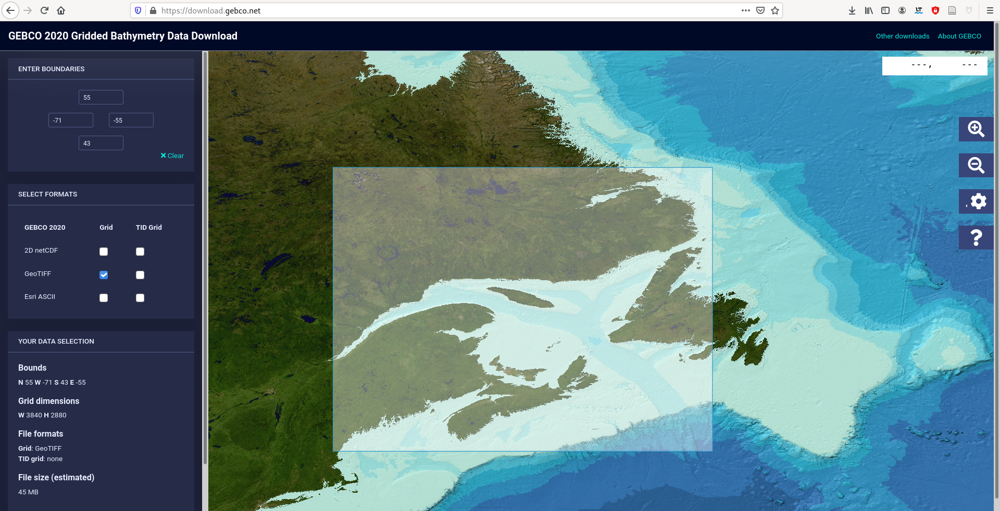

---

class: inverse, center, middle

# `r nf()` Introduction to `stars`


## `r ck()` ~20min


---

# Package [`stars`](https://CRAN.R-project.org/package=stars): SpatioTemporal ARrayS

### Extent `sf` to Raster and Vector Datacubes

.center[[](https://r-spatial.github.io/stars/index.html)] 
.right[.font80[see https://r-spatial.github.io/stars/index.html]]


---
# Example file 



- https://download.gebco.net/ 
- `r lk()` [data_and_script.zip](https://github.com/inSilecoInc/workshop_raster/raw/main/data_and_script.zip)


---
# Read with [`stars`](https://CRAN.R-project.org/package=stars)

```{R read_stars}
library(stars)
ras <- read_stars("data/bathy.tif")   # argument `driver` to specify the driver
class(ras)
ras
```


---
# What do we have? 

```{R stars_obj_fun1}
dim(ras)
st_bbox(ras)
```

---
# What do we have? 

```{R stars_obj_fun2}
ras_crs <- st_crs(ras)
class(ras_crs)
ras_crs
```

---
# What do we have? 

```{R stars_obj_fun3}
ras_crs$input
ras_crs$proj4string
ras_crs$epsg
```
--

- https://epsg.io/
- https://epsg.io/4326


---
# Conversion between [`stars`](https://CRAN.R-project.org/package=stars) and [`raster`](https://CRAN.R-project.org/package=raster)

```{R convert1}
library(raster)
rar <- raster("data/bathy.tif")
ras_c <- st_as_stars(rar) 
class(ras_c)
```

--

```{R convert2}
rar_c <- as(ras, "Raster") 
class(rar_c)
```


---
# Basic cell-based computations with [`stars`](https://CRAN.R-project.org/package=stars)

```{R}
class(ras[[1]])
class(ras[["bathy.tif"]])
class(ras$bathy.tif)
```

---
# Use units with [`units`](https://CRAN.R-project.org/package=units)

```{R}
library(units)
as_units(1, "mm") + as_units(1, "cm")
```

--

```{R}
units::as_units(0, "celsius") + units::as_units(0, "fahrenheit")
```

---
# Basic cell-based computations with [`stars`](https://CRAN.R-project.org/package=stars)

```{R nounit}
ras_nounit <- drop_units(ras)
class(ras_nounit[[1]])
```


---
# Basic cell-based computations with [`stars`](https://CRAN.R-project.org/package=stars)

```{R bc_ras1}
# extract value
ras[[1]][1, 1]
ras[[1]][1:10, 11:20]
```

---
# Basic cell-based computations with [`stars`](https://CRAN.R-project.org/package=stars)


```{R apply}
# mean along latitude
m_lat <- apply(ras[[1]], 2, mean)
m_lat[1:10]
# mean along longitude
m_lon <- apply(ras[[1]], 1, mean)
m_lon[1:10]
```


---
# Basic cell-based computations with [`stars`](https://CRAN.R-project.org/package=stars)

```{R}
lon <- st_get_dimension_values(ras, 1)
lat <- st_get_dimension_values(ras, 2)
```

---
# Basic cell-based computations with [`stars`](https://CRAN.R-project.org/package=stars)

```{R}
plot(lat, m_lat)
```

---
# Basic cell-based computations with [`stars`](https://CRAN.R-project.org/package=stars)

```{R bc_ras1_2}
range(ras[[1]])  # min/max
diff(range(ras[[1]]))
mean(ras[[1]]) 
quantile(ras[[1]])
```

---
# Basic plot with [`stars`](https://CRAN.R-project.org/package=stars)

```{R plot_stars, cache = TRUE}
plot(ras)
```

---
# Basic plot with [`stars`](https://CRAN.R-project.org/package=stars)

```{R plot_stars_ar, cache = TRUE, fig.width = 9.5, fig.height = 4}
par(mfrow = c(1, 2))
hist(ras[[1]])
plot(density(ras[[1]]))
```


---
# Available drivers

### - GeoTIFF `r ch()`

--

### - Other formats, how do we know?

```{R stars_drivers}
st_dr <- sf::st_drivers(what = "raster")
head(st_dr)
```

---
# Check read/write capabilities with 


```{R stars_drivers2}
st_dr[which(st_dr$name == "GTiff"), ]
```

--
.right[

.font80[`r nf()` https://gdal.org/drivers/raster/index.html]

.font80[`r nf()` https://keen-swartz-3146c4.netlify.app/intro.html#reading]

]


---
# Write raster files

##  .center[.font200[`r rp()` `r ar()` `r fl()`]]

--

## - Share the output file

--

## - Use another software (e.g. QGIS)

--

<br>

### `r rfa("exclamation-circle")` Create an `output` directory

```{R create_dir}
dir.create("output", showWarnings = FALSE)
```


---
# Write with [`stars`](https://CRAN.R-project.org/package=stars)

```{R write_stars0}
sort(st_dr$name[st_dr$write])
```

---
# Write with [`stars`](https://CRAN.R-project.org/package=stars)

```{R write_stars1, cache = TRUE}
write_stars(ras, dsn = "output/ras.gpkg", driver = "GPKG")
```

`r rfa("pencil-alt")` dsn stands for **data source name**.


---
# `r rfa("flag-checkered")` Recap 

<br><br>

| Action            | *raster*                 | *stars*               |
|:------------------|:-------------------------|:----------------------|
| list drivers      | `rgdal::gdalDrivers()`   | `sf::st_drivers()`    |
| read files        | `raster()`               | `read_stars()`        |
| write files       | `writeRaster()`          | `write_stars()`       |


---
# Create a raster from scratch: Matrix

```{R from_mat}
M1 <- matrix(runif(36), 6, 6)
M1
```

---
# Create a raster from scratch: Matrix

```{R}
ras_M1 <- st_as_stars(M1) 
ras_M1
st_crs(ras_M1)
```

---
# Create a raster from scratch: Matrix

```{R}
plot(ras_M1)
```

---
# Create a raster from scratch: Matrix

```{R}
st_crs(ras_M1) <- st_crs(4326)
st_crs(ras_M1)
```


---
# Create a raster from scratch: Data Frame

```{R}
D1 <- expand.grid(lon = 1:10, lat = 1:10) 
D1$val <- runif(100)
head(D1)
```

---
# Create a raster from scratch: Data Frame

```{R}
ras_D1 <- st_as_stars(D1, coords = c("lon", "lat"))
st_crs(ras_D1) <- st_crs(4326)
ras_D1
```

* See `?st_as_stars` for more details.