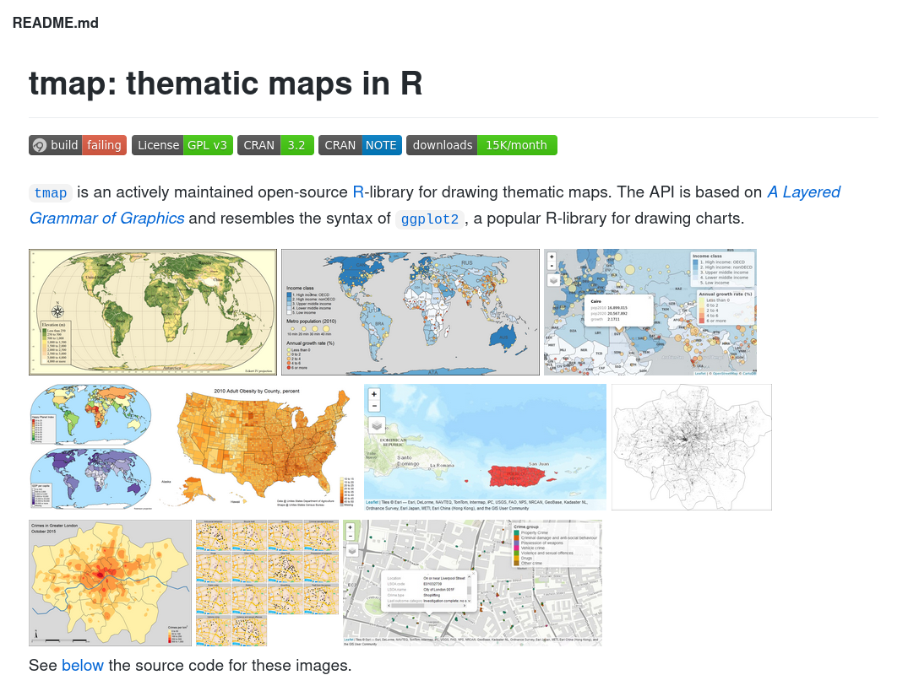

```{r include = FALSE}
source("_setup.R")
```

---

class: inverse, center, middle

# `r nf()` Create maps with `tmap`


## `r ck()` ~25min


---
# [`tmap`](https://CRAN.R-project.org/package=tmap)

.center[]

`r nf()` https://github.com/mtennekes/tmap


---
# [`tmap`](https://CRAN.R-project.org/package=tmap)

```{R tmap0, echo = -c(1:2)}
stl <- sf::st_read('data/st_laurence.geojson', quiet = TRUE)
ras <- stars::read_stars("data/bathy.tif") 
library(tmap)
map0 <- tm_shape(stl) + tm_borders(col = "red")
map0
```

---
# [`tmap`](https://CRAN.R-project.org/package=tmap)

```{R tmap1}
map1 <- map0 + tm_compass(type = "8star", position = c("left", "top")) 
map1 
```

---
# [`tmap`](https://CRAN.R-project.org/package=tmap)


- works with [`raster`](https://CRAN.R-project.org/package=raster) and [`stars`](https://CRAN.R-project.org/package=stars) (the latter is recommended)

--

### Let's focus on [`stars`](https://CRAN.R-project.org/package=stars)

```R
# create a stars object from a raster one
st_as_stars(rar)
# create a raster object from a stars one
as(ras, "Raster") 
```

---
# [`tmap`](https://CRAN.R-project.org/package=tmap)

```{R tmap2, cache = TRUE}
names(ras)
map2 <- tm_shape(ras) + tm_raster("bathy.tif")
```


---
# [`tmap`](https://CRAN.R-project.org/package=tmap)

```{R tmap3, cache = TRUE}
map3 <- map2 + map1  # the order matters
map3
```


---
# [`tmap`](https://CRAN.R-project.org/package=tmap)

```{R tmap4, cache = TRUE}
map4 <- map2 + map1 + tm_style("bw")
map4
```

---
# [`tmap`](https://CRAN.R-project.org/package=tmap)

```{R tmap5, cache = TRUE}
map5 <- tm_shape(ras) + tm_raster("bathy.tif", breaks = c(seq(-5000,
    0, 1000), 250, 500, 750, 1000), palette = "viridis") 
map5 
```

---
# [`tmap`](https://CRAN.R-project.org/package=tmap)


- `r nf()` https://geocompr.robinlovelace.net/adv-map.html

- `r nf()` https://github.com/mtennekes/tmap

- `r nf()` https://www.rdocumentation.org/packages/tmap/versions/3.2/topics/tm_layout


