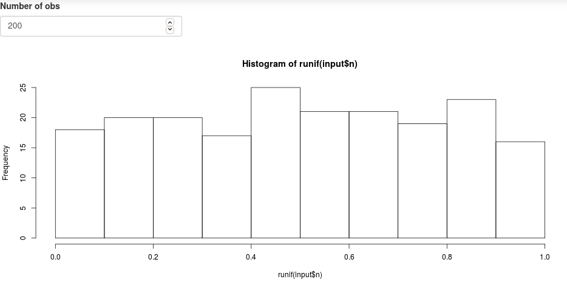

```{r include = FALSE}
source("_setup.R")
xaringanExtra::use_scribble()
```

---
class: inverse, center, middle

# `r nf()` Minimal Shiny App


## `r ck()` ~20min


---
# Minimal Shiny App

`r lc()` [Simple shiny app](https://shiny.rstudio.com/gallery/single-file-shiny-app.html)

.pull-left[
```{R eval = FALSE}
# Global variables can go here
n <- 200

# Define the UI
ui <- bootstrapPage(
  numericInput('n', 'Number of obs', n),
  plotOutput('plot')
)

# Define the server code
server <- function(input, output) {
  output$plot <- renderPlot({
    hist(runif(input$n))
  })
}

# Return a Shiny app object
shinyApp(ui = ui, server = server)

```
]

.pull-right[
  
  

]


---
# Minimal Shiny App

## Structure

- User interface object `ui`:

  - Controls layout and appearance of the app
  - Front end of the app
  - What the user sees and interacts with

--

- Server function `server`:

  - Instructions sent to the computer/server running R to build the app
  - Back end of the application

--

- A call to the shinyApp function `shinyApp(ui, server)`


---
# Minimal Shiny App: `ui` `r ey()`

```R
ui <- bootstrapPage(
  numericInput('n', 'Number of obs', n),
  plotOutput('plot')
)
```

--

1. `ui` is the output of a function that creates a Shiny UI page (HTML), which defines the layout and its content.

--

2. layout: `bootstrapPage()` (see [Application layout guide](https://shiny.rstudio.com/articles/layout-guide.html))

--

3. input: `numericInput()` (see [Control widget](https://shiny.rstudio.com/gallery/widget-gallery.html))

--

4. output: `plotOutput()` (see [Display reactive output](https://shiny.rstudio.com/tutorial/written-tutorial/lesson4/))


---
# Minimal Shiny App: `server` `r cg()`

```R
server <- function(input, output) {
  output$plot <- renderPlot({
    hist(runif(input$n))
  })
}
```

--

1. server is a function of `input` and `output` and optionally `session` (not covered here, but see [Session object](https://shiny.rstudio.com/reference/shiny/1.6.0/session.html))

2. process output: `renderPlot()` (see [Display reactive output](https://shiny.rstudio.com/tutorial/written-tutorial/lesson4/))


`r tr()` all `render*()` functions render reactive **output**, they 
capture R expressions and perform some light pre-processing to make the object suitable for the corresponding `*Output()` function in `ui`.


---
# Minimal Shiny App: `server` `r cg()`

## [Reactive output](https://shiny.rstudio.com/tutorial/written-tutorial/lesson4/)

.font90[
| Output function (`ui`) | Render function (`server`) | Creates |
| :--------------------- | :------------------------- | :------ |
| `dataTableOutput` |	`renderDataTable()` | DataTable |
| `htmlOutput` | `renderImage()` | raw HTML |
| `imageOutput` |	`renderImage()` | image |
| `plotOutput` |	`renderPlot()` | plot |
| `tableOutput` |	`renderTable()` | table |
| `textOutput` |	`renderText()` | text |
| `uiOutput` | `renderUI()` | raw HTML |
| `verbatimTextOutput` | `renderVerbatimText()` |	text |
| `leafletOutput()` | `renderLeaflet()` | leaflet map |
]


---
# Minimal Shiny App: run the app

```R
shinyApp(ui = ui, server = server)
```

`r lc()` Trigger the application. 

--

There are several ways to do so, see [App formats and launching apps](https://shiny.rstudio.com/articles/app-formats.html).


---
# Minimal Shiny App: community 

- As often with `r rp()`, one of the major strength is the community: 

--
  - academics / researchers
  - growing bigger and bigger
  
</br>

--

- List of resources: [awesome-shiny-extensions](https://github.com/nanxstats/awesome-shiny-extensions)


---
# Minimal shiny App v2